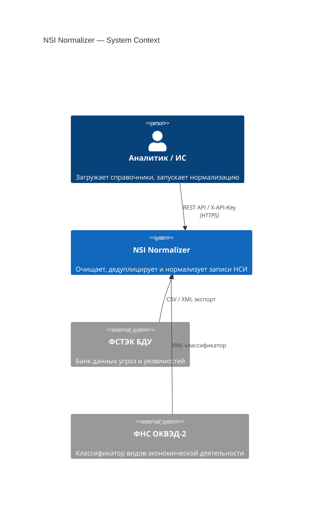
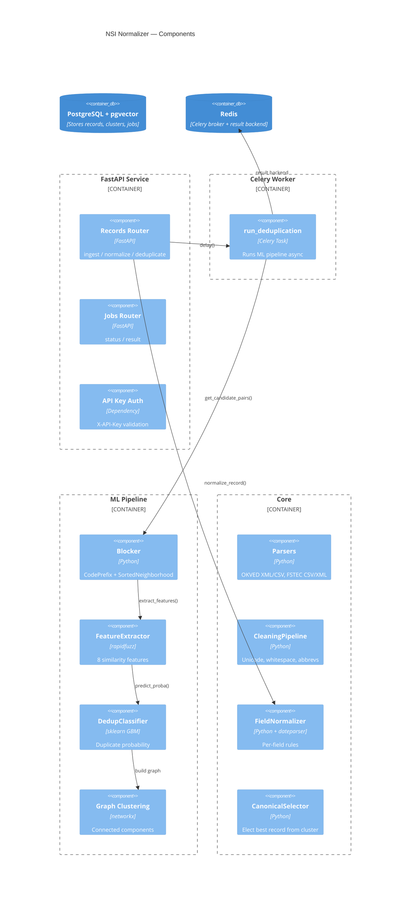
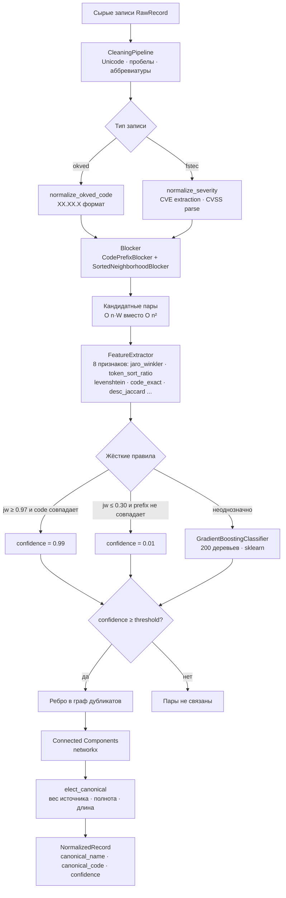
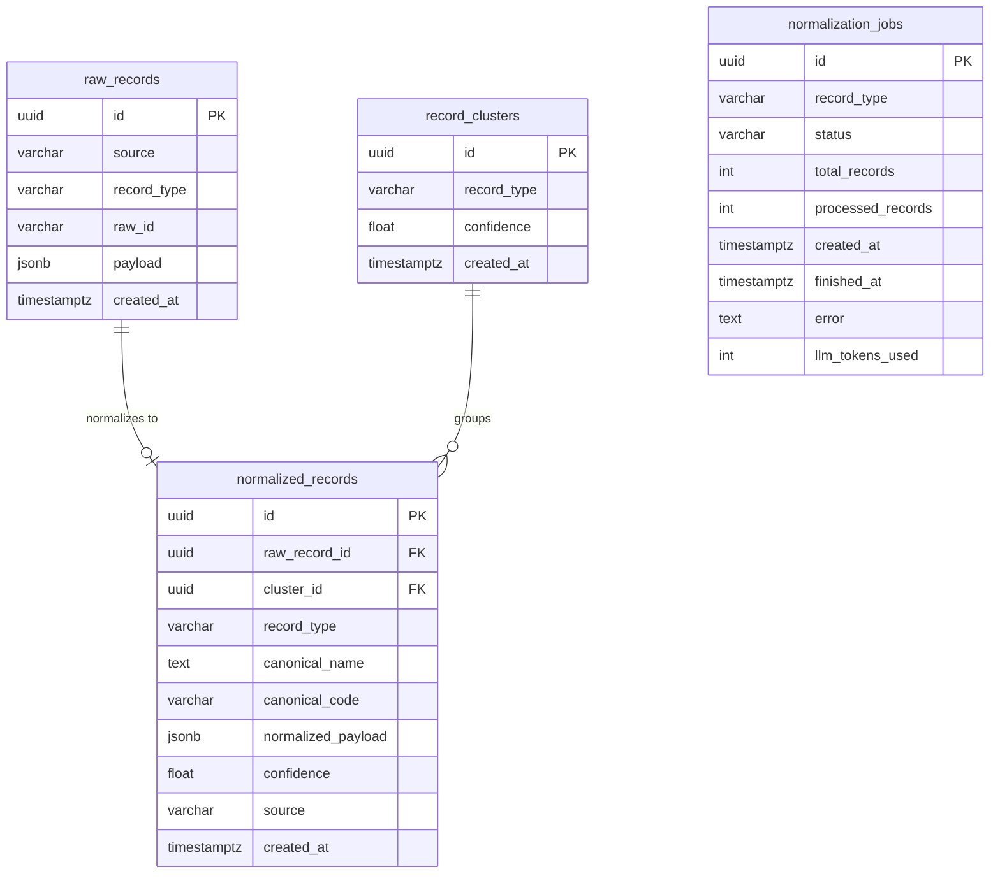

# Architecture

## C4 Context Diagram

```mermaid
C4Context
    title NSI Normalizer — System Context

    Person(analyst, "Аналитик / ИС", "Загружает справочники, запускает нормализацию")

    System(nsi, "NSI Normalizer", "Очищает, дедуплицирует и нормализует записи НСИ")

    System_Ext(fstec, "ФСТЭК БДУ", "Банк данных угроз и уязвимостей")
    System_Ext(fns, "ФНС ОКВЭД-2", "Классификатор видов экономической деятельности")

    Rel(analyst, nsi, "REST API / X-API-Key", "HTTPS")
    Rel(fstec, nsi, "CSV / XML экспорт")
    Rel(fns, nsi, "XML классификатор")
```

## Component Diagram

```mermaid
C4Component
    title NSI Normalizer — Components

    Container_Boundary(api, "FastAPI Service") {
        Component(router_rec, "Records Router", "FastAPI", "ingest / normalize / deduplicate")
        Component(router_jobs, "Jobs Router", "FastAPI", "status / result")
        Component(dep_auth, "API Key Auth", "Dependency", "X-API-Key validation")
    }

    Container_Boundary(worker, "Celery Worker") {
        Component(task_dedup, "run_deduplication", "Celery Task", "Runs ML pipeline async")
    }

    Container_Boundary(ml, "ML Pipeline") {
        Component(blocker, "Blocker", "Python", "CodePrefix + SortedNeighborhood")
        Component(features, "FeatureExtractor", "rapidfuzz", "8 similarity features")
        Component(clf, "DedupClassifier", "sklearn GBM", "Duplicate probability")
        Component(cluster, "Graph Clustering", "networkx", "Connected components")
    }

    Container_Boundary(core, "Core") {
        Component(parser, "Parsers", "Python", "OKVED XML/CSV, FSTEC CSV/XML")
        Component(cleaner, "CleaningPipeline", "Python", "Unicode, whitespace, abbrevs")
        Component(normalizer, "FieldNormalizer", "Python + dateparser", "Per-field rules")
        Component(selector, "CanonicalSelector", "Python", "Elect best record from cluster")
    }

    ContainerDb(pg, "PostgreSQL + pgvector", "Stores records, clusters, jobs")
    ContainerDb(redis, "Redis", "Celery broker + result backend")

    Rel(router_rec, task_dedup, "delay()")
    Rel(router_rec, normalizer, "normalize_record()")
    Rel(task_dedup, blocker, "get_candidate_pairs()")
    Rel(blocker, features, "extract_features()")
    Rel(features, clf, "predict_proba()")
    Rel(clf, cluster, "build graph")
    Rel(task_dedup, redis, "result backend")
```

## ML Pipeline Flowchart

```mermaid
flowchart TD
    A[Сырые записи RawRecord] --> B[CleaningPipeline\nUnicode · пробелы · аббревиатуры]
    B --> C{Тип записи}
    C -->|okved| D[normalize_okved_code\nXX.XX.X формат]
    C -->|fstec| E[normalize_severity\nCVE extraction · CVSS parse]
    D & E --> F[Blocker\nCodePrefixBlocker + SortedNeighborhoodBlocker]
    F --> G[Кандидатные пары\nO n·W вместо O n²]
    G --> H[FeatureExtractor\n8 признаков: jaro_winkler · token_sort_ratio\nlevenshtein · code_exact · desc_jaccard ...]
    H --> I{Жёсткие правила}
    I -->|jw ≥ 0.97 и code совпадает| J[confidence = 0.99]
    I -->|jw ≤ 0.30 и prefix не совпадает| K[confidence = 0.01]
    I -->|неоднозначно| L[GradientBoostingClassifier\n200 деревьев · sklearn]
    J & K & L --> M{confidence ≥ threshold?}
    M -->|да| N[Ребро в граф дубликатов]
    M -->|нет| O[Пары не связаны]
    N --> P[Connected Components\nnetworkx]
    P --> Q[elect_canonical\nвес источника · полнота · длина]
    Q --> R[NormalizedRecord\ncanonical_name · canonical_code · confidence]
```

## Database ER Diagram

```mermaid
erDiagram
    raw_records {
        uuid id PK
        varchar source
        varchar record_type
        varchar raw_id
        jsonb payload
        timestamptz created_at
    }

    record_clusters {
        uuid id PK
        varchar record_type
        float confidence
        timestamptz created_at
    }

    normalized_records {
        uuid id PK
        uuid raw_record_id FK
        uuid cluster_id FK
        varchar record_type
        text canonical_name
        varchar canonical_code
        jsonb normalized_payload
        float confidence
        varchar source
        timestamptz created_at
    }

    normalization_jobs {
        uuid id PK
        varchar record_type
        varchar status
        int total_records
        int processed_records
        timestamptz created_at
        timestamptz finished_at
        text error
        int llm_tokens_used
    }

    raw_records ||--o| normalized_records : "normalizes to"
    record_clusters ||--o{ normalized_records : "groups"
```
